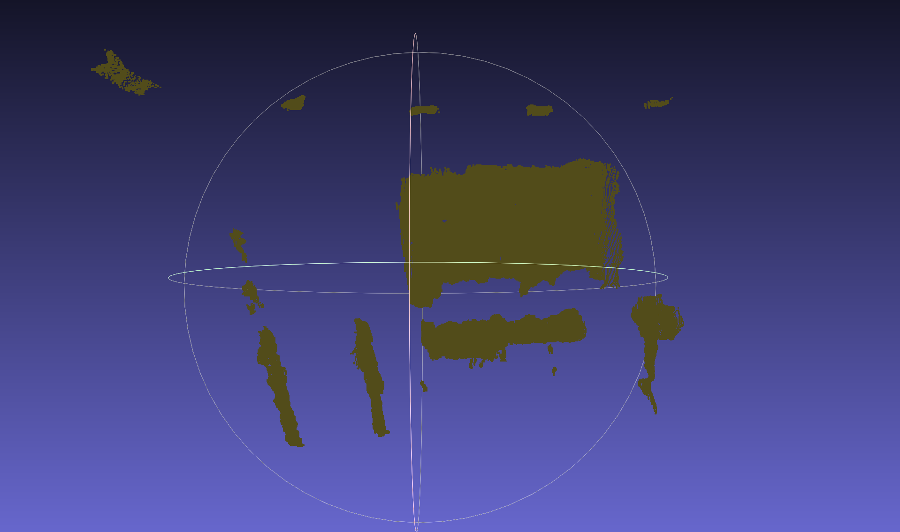

# Como realizar la calibración estereo

En primer lugar, deberá seguirse el protocolo estándar de C++ de cmakelist: 

``sh
mkdir build; cd build; cmake ..; make
``

``sh
./stereo_disparity ../stereo/reconstruction/m001.jpg ../stereo/stereoparms.yml out.obj
``

Un ejemplo de malla obtenida con los parámetros definidos en stereoBM sería la siguiente:

